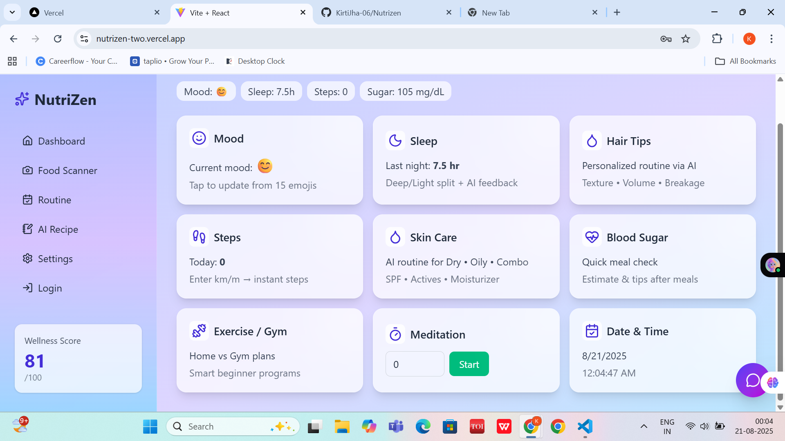

# 🌿 NutriZen - AI Wellness Dashboard  

NutriZen is an **AI-powered Wellness Dashboard** that helps users track and improve their health with personalized recommendations for mood, sleep, skincare, fitness, and nutrition.  

---

## ✨ Features  

- 🧠 **Mood Tracking** – Select from  emojis & get AI-based health tips  
- 😴 **Sleep Analysis** – Deep vs Light sleep insights with AI feedback  
- 💇 **Hair Care** – Personalized routine based on hair texture & volume  
- 👣 **Step Tracker** – Distance → Instant step conversion  
- 🍬 **Blood Sugar Estimation** – Quick check after meals with AI tips  
- ✨ **Skin Care** – Routine based on Dry / Oily / Combination skin type  
- 🏋️ **Exercise / Gym Plans** – Get exercise tips
- 🧘 **Meditation Timer** – Track your meditation sessions  
- 📅 **Routine Tracker** – Mark daily tasks & track progress  
- 🍲 **AI Recipe Generator** – Get healthy recipes from available ingredients  
- 📸 **Food Scanner** – Upload food photos → AI identifies + gives nutritional breakdown (Protein, Carbs, Calories, Fat)  

---

## 📊 Wellness Score  
Your health is summarized into a **Wellness Score (/100)** based on activity, sleep, and nutrition.  

---

## 🖼️ UI Preview

### Dashboard  
  
---

## 🚀 Tech Stack  

- **Frontend:** React (Vite)  
- **UI Framework:** TailwindCSS  
- **AI / Backend:** Custom AI models & APIs  
- **Deployment:** Vercel  

---

## ⚙️ Installation  

Clone the repository:  
```bash
git clone https://github.com/your-username/nutrizen.git
cd nutrizen
